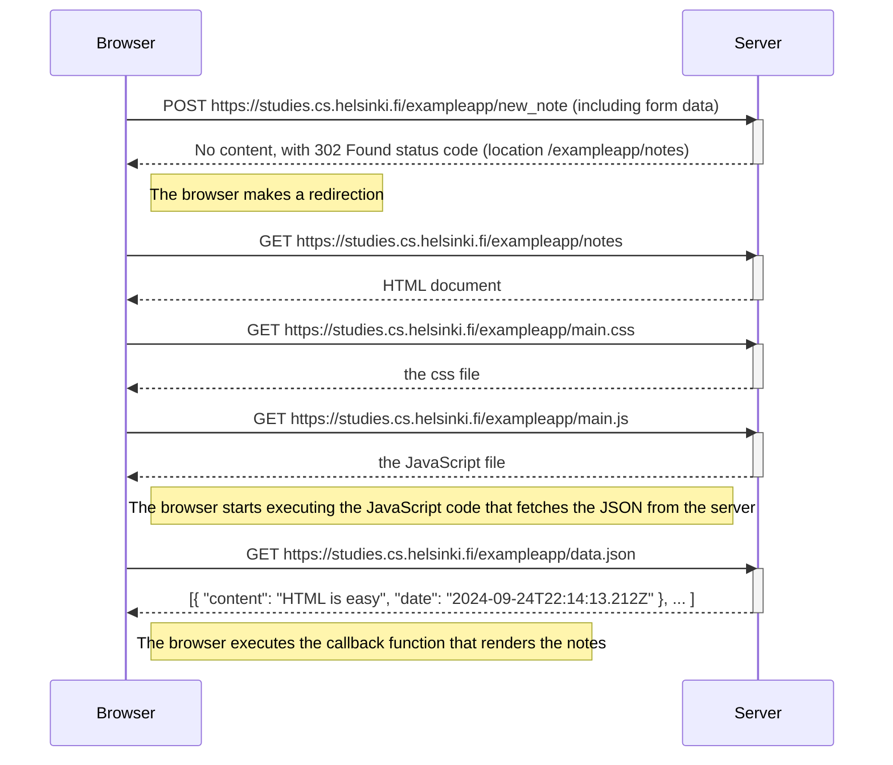

```mermaid
sequenceDiagram
  participant Browser as Browser
  participant Server as Server

  Browser->>Server: POST https://studies.cs.helsinki.fi/exampleapp/new_note (including form data)
  activate Server
  Server-->>Browser: No content, with 302 Found status code (location /exampleapp/notes)
  deactivate Server
  Note right of Browser: The browser makes a redirection


  Browser->>Server: GET https://studies.cs.helsinki.fi/exampleapp/notes
  activate Server
  Server-->>Browser: HTML document
  deactivate Server

  Browser->>Server: GET https://studies.cs.helsinki.fi/exampleapp/main.css
  activate Server
  Server-->>Browser: the css file
  deactivate Server

  Browser->>Server: GET https://studies.cs.helsinki.fi/exampleapp/main.js
  activate Server
  Server-->>Browser: the JavaScript file
  deactivate Server

  Note right of Browser: The browser starts executing the JavaScript code that fetches the JSON from the server

  Browser->>Server: GET https://studies.cs.helsinki.fi/exampleapp/data.json
  activate Server
  Server-->>Browser: [{ "content": "HTML is easy", "date": "2024-09-24T22:14:13.212Z" }, ... ]
  deactivate Server

  Note right of Browser: The browser executes the callback function that renders the notes
```
