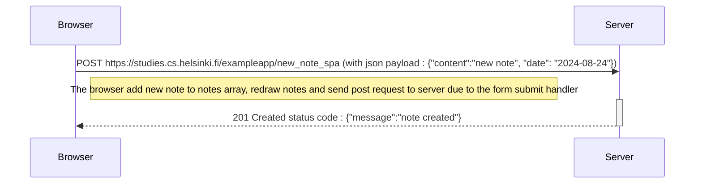

```mermaid
sequenceDiagram
  participant Browser as Browser
  participant Server as Server

  Browser->>Server: POST https://studies.cs.helsinki.fi/exampleapp/new_note_spa (with json payload : {"content":"new note", "date": "2024-08-24"})
  Note right of Browser: The browser add new note to notes array, redraw notes and send post request to server due to the form submit handler

  activate Server
  Server-->>Browser: 201 Created status code :  {"message":"note created"}
  deactivate Server

```
